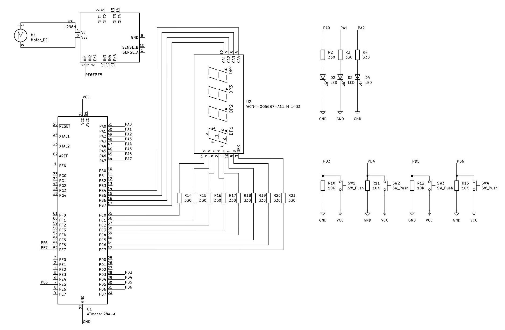
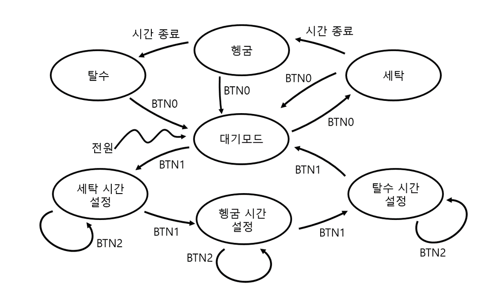
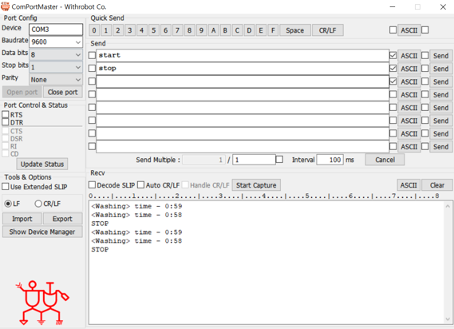
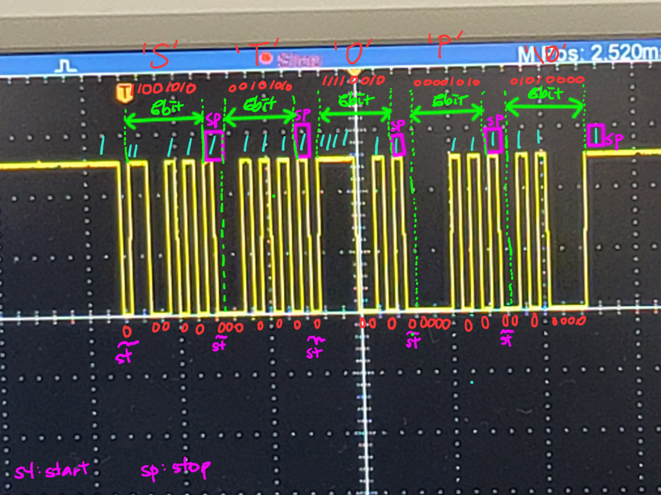

# 🧺 Smart Washing Machine System Architecture
> **ATmega128A 마이크로컨트롤러 기반의 임베디드 세탁 시퀀스 제어 시스템 구현 및 검증**

---

## 1. 프로젝트 개요 (Introduction)
- **개발 기간**: 2026.06
- **개발 인원**: 김호철 (1인 프로젝트)
- **연구 목적**:
  - MCU 핵심 주변 장치(Timer/Counter, PWM, UART)의 하드웨어 자원을 유기적으로 연동
  - 사용자 설정 인터페이스에 따른 가변적 시퀀스 제어 알고리즘(FSM) 설계
  - `_delay_ms()`를 배제하고 실시간 인터럽트 타이머 기반의 비차단(Non-blocking) 스케줄러 구현
  - PC 환경과의 비동기 시리얼 통신을 통한 외부 제어 인터페이스 구축 및 무결성 검증

---

## 2. 하드웨어 구성 및 명세 (Bill of Materials)

| No. | 부품명 (Part Name) | 주요 규격 (Specification) | 수량 (Qty.) | 용도 및 비고 (Remarks) |
| :---: | :--- | :--- | :---: | :--- |
| **1** | ATmega128A | 8-bit AVR MCU, 16MHz | 1 | 메인 시스템 제어 및 하드웨어 스케줄링 가동 |
| **2** | L298N Driver | Dual H-Bridge Module | 1 | DC 모터 정/역방향 회전 제어 및 PWM 전류 구동 |
| **3** | 4-Digit FND | Common Anode Type | 1 | 잔여 시간 표출(분/초) 및 다이내믹 멀티플렉싱 출력 |
| **4** | Tact Switch | 4-Pin Push Button | 4 | 사용자 제어 입력 (시작/정지, 모드 전환, 시간 설정) |
| **5** | LED | 3mm / 5mm Indicator | 3 | 시스템 현재 공정 상태 표시 (세탁 / 헹굼 / 탈수) |
| **6** | Axial Resistor | $10\text{ k}\Omega$, 1/4W, 5% (갈흑주) | 4 | 스위치 회로 노이즈 차단용 풀다운(Pull-down) 저항 |
| **7** | Axial Resistor | $330\ \Omega$, 1/4W, 5% (주주갈) | 3 | LED 과전류 방지 및 회로 소자 보호용 저항 |

---

## 3. 시스템 아키텍처 및 회로 설계 (System Architecture)

### 📌 하드웨어 회로도 (Circuit Schematic)


### 📌 유한 상태 머신 (Finite State Machine, FSM)
시스템은 사용자의 조작 안정성을 보장하기 위해 명확한 상태 천이도를 기반으로 구동됩니다.
- **STATE_STANDBY**: 시스템 초기화 및 전 장치(모터, 디스플레이) 강제 일괄 정지 안전 모드
- **STATE_SETTING**: 버튼 입력을 통해 세탁 ➔ 헹굼 ➔ 탈수 각 코스의 가동 시간을 독립적으로 설정하는 모드
- **STATE_RUNNING**: 실시간 타임 차감 카운트다운 가동 및 공정별 타겟 PWM 속도로 모터 가변 제어 구동



---

## 4. 소프트웨어 아키텍처 (S/W Implementation)

### 📌 핵심 알고리즘 및 데이터 구조
세탁 코스의 데이터 관리를 구조체로 추상화하고, 무한 루프 환경 내에서 **1ms 정밀 하드웨어 타이머 스케줄러**를 통해 각 태스크를 비차단 방식으로 멀티태스킹 처리합니다.

```c
// 1. 세탁기 제어용 데이터 구조체 캡슐화
typedef enum {
    STATE_STANDBY, // 대기 모드
    STATE_SETTING, // 시간 설정 모드
    STATE_RUNNING  // 수행 모드
} system_state_t;

typedef enum {
    WASH = 0, RINSE, SPIN
} washing_type_t;

typedef struct {
    uint16_t ms;   // 밀리초 카운트
    uint8_t sec;   // 초 데이터
    uint8_t min;   // 분 데이터
} washing_time_t;

typedef struct {
    washing_type_t type;       // 세탁 모드 종류
    washing_time_t set_time;   // 설정된 기본 시간
    uint8_t motor_speed;       // 해당 단계의 모터 PWM 속도
} washing_machine_t;

// 2. 메인 커널 루프: 1ms 타이머 기반 스케줄링 가동
while (1)
{
    // 실시간 비동기 버튼 엣지 스캔
    for(i = 0; i < BUTTON_COUNT; i++) {
        if (get_button_state(i)) {
            on_button_press_funcs[i](); // 매핑된 인터페이스 핸들러 실행
            break;
        }
    }
    
    // 1ms 주기의 하드웨어 타이머 핸들러 가동 (Non-blocking 스케줄러)
    if (ms_count - last_refresh_time >= 1) {
        last_refresh_time = ms_count;
        
        if (current_state == STATE_RUNNING) {
            update_current_time();  // 실시간 남은 시간 차감 계산
            update_running_step();  // 시간 종료 시 다음 코스로 자동 시퀀스 점프
        }
        // 상태별 FND 다이내믹 멀티플렉싱 화면 출력 
        fnd_mode_funcs[current_state](current_time->sec, current_time->min);
    }
    pc_command_processing(); // PC UART 비동기 명령어 수신 및 원형 큐 검사
}
```

---

## 5. 시스템 동작 시연 및 기능 검증 (Verification)

### 📌 시연 환경 및 데이터 모니터링 (ComPortMaster 연동)
PC 시리얼 터미널 프로그램(`ComPortMaster`)을 연동하여 9600bps 보레이트로 실시간 데이터를 양방향 제어합니다. 



- **명령어 수신**: PC에서 `start` 및 `stop` 문자열 명령을 전송하면 UART 수신 인터럽트가 발생하여 Circular Queue에 저장 후 비동기 처리됩니다.
- **실시간 로그 송신**: 시스템은 현재 진행 중인 공정 모드 상태와 남은 시간 데이터(`" <Washing> time - 0:59 "`)를 1초 주기로 PC 터미널 창에 실시간 출력합니다.

---

### 📌 오실로스코프 신호 분석 (UART Physical Layer)
동작 신호의 무결성을 확보하기 위해 오실로스코프로 UART 통신선(TX/RX)의 물리 계층 신호를 직접 계측 및 분석하여 하드웨어 동작을 최종 검증했습니다.



- **Baud Rate 타이밍 측정**: 9600 bps 속도의 1비트 폭 실측 결과가 약 $104.16\mu\text{s}$ ($1 \div 9600 \approx 104.16\mu\text{s}$)로 타이머 레지스터 오차 없이 정확히 일치함을 확인했습니다.
- **데이터 프레임 파싱 무결성**: 하강 엣지(Falling Edge) 트리거 포인트를 기준으로 `Start Bit (st)` ➔ `Data Bit (8-bit)` ➔ `Stop Bit (sp)` 구조를 분석하여, 실제 데이터 시그널(예: `STOP` 명령어 프레임의 ASCII 매핑 구조)이 하드웨어 레벨에서 왜곡 없이 송수신됨을 검증 완료했습니다.

---

## 6. 트러블슈팅 및 개선점 (Troubleshooting)

프로젝트 빌드 및 하드웨어 통합 테스트 과정에서 발생한 핵심 문제점들과 이를 해결한 최적화 과정입니다.

### ⚠️ 문제점 1: 시간 체크 변수 관리 및 누락 오류
- **현상**: 여러 소스 파일 간에 실시간 시간 카운트 변수를 공유하는 과정에서 타이머 제어가 꼬이거나 변수 초기화가 누락되어 카운트다운이 멈추는 현상 발생.
- **원인**: 소스 파일 간 연동을 위한 `extern` 선언 누락 및 전역 변수의 무분별한 사용으로 인한 시점 제어 오류.
- **해결 방안**: 
  - 전역 변수의 사용을 최소화하고 인터페이스 함수 형태로 캡슐화.
  - 각 기능 함수들을 명확하게 헤더 파일에 선언하여 참조 누락을 구조적으로 방지.
  - 전체 시스템 내에서 공정 제어용 시간 체크 변수를 하나로 통일하여 동기화 성능 개선.

### ⚠️ 문제점 2: 매크로 중복 선언으로 인한 빌드 에러
- **현상**: 기능이 확장됨에 따라 컴파일 시 매크로 중복 정의(Redefinition) 경고 및 빌드 에러 발생.
- **원인**: 소스 파일 및 헤더 파일마다 동일한 하드웨어 제어용 매크로 제어 코드가 개별적으로 선언되어 꼬임 발생.
- **해결 방안**: 프로그래밍 아키텍처 개선을 위해 프로젝트 공통 매크로 및 상수 정의를 전용 헤더 파일인 `define.h` 파일 하나로 모아서 중앙 집중식으로 관리함으로써 해결.

### ⚠️ 문제점 3: 매크로 자료형 연산 오류로 인한 비정상 값 출력
- **현상**: 레지스터 분주비 및 타이머 카운트 계산용 매크로 연산 시, 의도치 않은 쓰레기 값이나 잘못된 타이밍 주기가 계산되어 출력됨.
- **원인**: 16MHz 클럭 연산 시 상수의 크기가 일반 `int` 범위를 초과하거나, 컴파일러의 암시적 형변환에 의해 상위 비트가 손실되는 현상 발생.
- **해결 방안**: 매크로 수식 계산 시 명시적 자료형 변환(`(uint32_t)` 등 매크로 형변환)을 컴파일러에 지시하여 대용량 상수의 연산 무결성을 확보함으로 해결.

---
